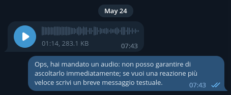

# No voice policy 

Automatically replies to any private voice message asking the effort to write a text message instead.

## How to use

See generic instructions [how to use](https://github.com/24mu13/telegram-extras?tab=readme-ov-file#how-to-use) an extra.

Additionally, you could set the following environment variables:
* **REPLY_LANG**, language code (by default, `en_US`)
* **REPLY_VOICE**, .ogg file to reply with an additional voice message

## Closest feature

 

**Requires [Premium](https://telegram.org/faq_premium/) subscription**: allowing just few contacts or nobody to send you voice messages.

1. Open *Settings* in Telegram app
2. *Privacy and Security*
3. Privacy, *Voice Messages*
4. *Nobody* or *My Contacts*
